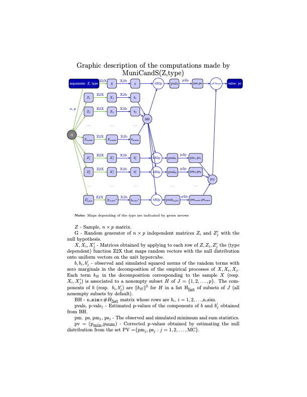

# MuniCandS

**Multivariate Tests of Uniformity, Normality Spherical and Elliptical symmetry and Independence**

## Overview

`MuniCandS` is an R package implementing Cramér-von Mises type tests for
multivariate distributions. Given an *n × p* data matrix (a sample of size *n*
in **R**^*p*), it tests whether the underlying distribution belongs to one of
the following families:

| `type` | Null hypothesis |
|--------|----------------|
| `"UC"` | Uniform on the unit hypercube [0,1]^*p* |
| `"US"` | Uniform on the hypersphere S^(*p*-1) |
| `"N"`  | Normal in **R**^*p* |
| `"I"`  | Isotropic (spherically symmetric) in **R**^*p* |
| `"E"`  | Elliptically symmetric in **R**^*p* |
| `"IN"` | Independent components in **R**^*p* |

The tests are based on a decomposition of a *p*-parameter Brownian sheet as
the sum of 2^*p* independent Gaussian processes, and the associated decomposition
of the empirical process, and produce two p-values
corresponding to the **m-test** and the **s-test**.

## Installation
```r
# install.packages("devtools")
devtools::install_github("emcabana/MuniCandS")
```

## Usage
```r
library(MuniCandS)

# Generate a sample from a multivariate normal distribution
set.seed(42)
X <- matrix(rnorm(200), nrow = 100, ncol = 3)

# Test normality
MuniCandS(X, type = "N")

```

## Functions




## Reference

Cabaña, A. and Cabaña, E. M. (2025). *Brownian sheet and uniformity tests on
the hypercube*. To appear in *Statistica*. arXiv:2509.06134.
<https://arxiv.org/abs/2509.06134>

## Authors

- Alejandra Cabaña — Universitat Autònoma de Barcelona, Spain
- Enrique M. Cabaña - PEDECIBA, Uruguay
