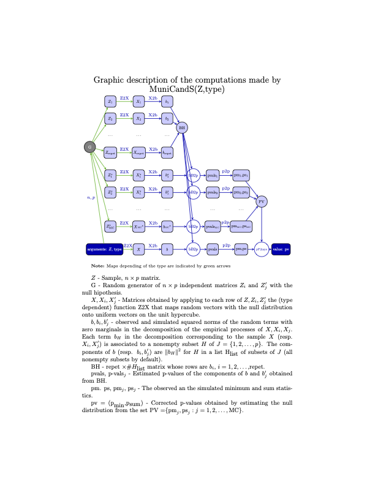

# MuniCandS

**Multivariate Tests of Uniformity, Normality Spherical and Elliptical symmetry and Independence**

## Overview

`MuniCandS` is an R package implementing Cramér-von Mises type tests for
multivariate distributions. Given an *n × p* data matrix (a sample of size *n*
in **R**^*p*), it tests whether the underlying distribution belongs to one of
the following families:

| `type` | Null hypothesis |
|--------|----------------|
| `"UC"` | Uniform on the unit hypercube [0,1]^*p* |
| `"US"` | Uniform on the hypersphere S^(*p*-1) |
| `"N"`  | Normal in **R**^*p* |
| `"I"`  | Isotropic (spherically symmetric) in **R**^*p* |
| `"E"`  | Elliptically symmetric in **R**^*p* |
| `"IN"` | Independent components in **R**^*p* |

The tests are based on a decomposition of a *p*-parameter Brownian sheet as
the sum of 2^*p* independent Gaussian processes, and the associated decomposition
of the empirical process, and produce two p-values
corresponding to the **m-test** and the **s-test**.

## Installation
```r
# install.packages("devtools")
devtools::install_github("emcabana/MuniCandS")
```

## Usage
```r
library(MuniCandS)

# Generate a sample from a multivariate normal distribution
set.seed(42)
X <- matrix(rnorm(200), nrow = 100, ncol = 3)

# Test normality
MuniCandS(X, type = "N")

```

## Schematic diagram of the computations



# Reusing Monte Carlo simulations with `cache`

The function `MuniCandS()` allows the reuse of Monte Carlo simulations through the optional `cache` argument. This can considerably reduce computation time when several datasets are analyzed under the same null hypothesis and simulation settings.

## Basic idea

The most computationally expensive objects generated by the procedure are:

* `BH`: simulated distributions of the component statistics,
* `PV`: simulated distributions of the combined m- and s-tests.

These quantities depend only on:

* the sample size `n`,
* the dimension `p`,
* the type of null hypothesis,
* the subset restrictions `hmin` and `hmax`,
* the simulation sizes `n_sim` and `n_mc`.

They do **not** depend on the observed sample itself.

Therefore, once these simulations have been generated, they can be reused for other datasets having the same dimensions and simulation settings.

# First call: generate the cache

```r
res <- MuniCandS(
  Z,
  type = "UC",
  n_sim = 500,
  n_mc = 500,
  return_cache = TRUE
)
```

The returned object contains:

```r
res$result
```

the p-values of the tests, and

```r
res$cache
```

the Monte Carlo simulations that may later be reused.

# Second call: reuse the cache

```r
res2 <- MuniCandS(
  Z2,
  type = "UC",
  n_sim = 500,
  n_mc = 500,
  cache = res$cache
)
```

In this second call, the expensive Monte Carlo simulations are skipped and the previously computed values are reused.

# Conditions for cache reuse

The cache is reused only if the following quantities are identical in both calls:

* sample size `n`,
* dimension `p`,
* test type (`"UC"`, `"US"`, `"N"`, `"I"`, `"E"`, `"IN"`),
* `hmin`,
* `hmax`,
* `n_sim`,
* `n_mc`.

The observed data matrix `Z` itself may change.

# Typical use case

```r
set.seed(1)

Z1 <- matrix(runif(300), ncol = 3)
Z2 <- matrix(runif(300), ncol = 3)

# First call: simulations are generated
res1 <- MuniCandS(
  Z1,
  type = "UC",
  n_sim = 500,
  n_mc = 500,
  return_cache = TRUE
)

# Second call: simulations are reused
res2 <- MuniCandS(
  Z2,
  type = "UC",
  n_sim = 500,
  n_mc = 500,
  cache = res1$cache
)
```

## Reference

Cabaña, A. and Cabaña, E. M. (2025). *Brownian sheet and uniformity tests on
the hypercube*. To appear in *Statistica*. arXiv:2509.06134.
<https://arxiv.org/abs/2509.06134>

## Authors

- Alejandra Cabaña — Universitat Autònoma de Barcelona, Spain
- Enrique M. Cabaña - PEDECIBA, Uruguay
